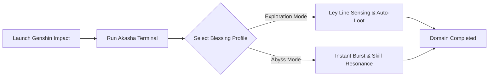

# 🏵️ NewEraAI-Genshin-Impact — Akasha Terminal & Teyvat Exploration Framework

  <!-- Кликабельные кнопки (Золотой / Анемо-бирюзовый стиль) -->
  
  

<!-- ПЛЕЙСХОЛДЕР ДЛЯ СКРИНШОТА ИНТЕРФЕЙСА -->

  

---

## ⚙️ Resonance Workflow Diagram

## 1. Elemental Sight & World Perception (Visual Assistance)
Smart Auto-Loot Filter: Automatically collects nearby drops, regional specialties, and chest rewards with zero interaction delay.
Oculi & Teleport Tracking: Displays spatial direction vectors toward missing Anemoculus, Geoculus, Electroculus, and Dendroculus nodes across Teyvat.
Interactive Map Overlay: Real-time distance telemetry and entity bounding boxes rendered directly through DWM.

---

## 2. Stella Fortuna Mapping & Target Alignment
Smart Auto-Loot Filter: Automatically collects nearby drops, regional specialties, and chest rewards with zero interaction delay.
Oculi & Teleport Tracking: Displays spatial direction vectors toward missing Anemoculus, Geoculus, Electroculus, and Dendroculus nodes across Teyvat.
Interactive Map Overlay: Real-time distance telemetry and entity bounding boxes rendered directly through DWM.

---

## Non-Invasive Safety & Zero-Ban Features. 
[UID MASKING ENGINE] — Automatically detects and obscures your in-game User ID on screen and within stream overlays.

[EXTERNAL OVERLAY RENDER] — Renders overlay graphics on an independent transparent desktop layer, making it 100% invisible to OBS, Discord, and Twitch screen captures.

[LOCAL HARDWARE ACCELERATION] — Computes image analysis processing locally on your GPU via DirectX/DirectCompute with minimal frame loss.

[NO INJECTION ARCHITECTURE] — Avoids memory hooking or modifying .dll libraries inside the client executable directory.

---

`genshin impact cheat`, `genshin hack 2026`, `free genshin cheat`, `genshin impact auto loot`, `genshin god mode`, `mhyprot2 bypass`, `genshin chest esp`, `genshin oculi teleport`, `genshin primogem hack`

<!-- update: A -->

> 💡 *IT Quote:* "_Talk is cheap. Show me the code. – Linus Torvalds_"
